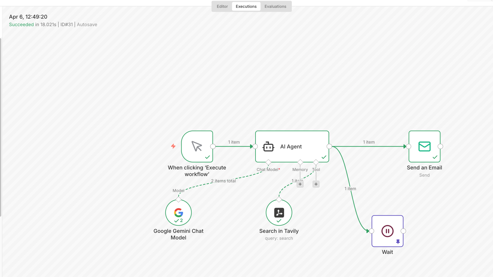

# n8n-AI-Market-Research-Agent
An autonomous AI agent built in n8n for real-time SWOT analysis with a Human-in-the-Loop approval gate.

# 🛡️ AI Market Research Agent (Human-in-the-Loop)

## 📖 Overview
I engineered a professional AI Research Agent using **n8n** that automates the generation of SWOT analyses for any target company. This system solves the problem of AI "hallucinations" by implementing a mandatory human approval gate before the workflow completes.

## 🛠️ The Tech Stack
- **Orchestrator:** n8n (Low-code workflow automation)
- **AI Brain:** Google Gemini 1.5 Flash
- **Search Engine:** Tavily AI (Real-time Agentic Search)
- **Communication:** SMTP (Gmail Relay) & Webhooks

## 🚀 Key Features
- **Real-Time Data Retrieval:** Unlike standard LLMs, this agent uses Tavily to search the *live* web for the latest financial news.
- **Parallel Execution Logic:** The workflow simultaneously triggers an email notification and a "Wait" state.
- **Human-in-the-Loop (HITL):** I implemented a secure webhook trigger. The workflow enters a "Suspended" state and only resumes/succeeds once I click the unique approval link in my inbox.

## 📸 Proof of Concept
 

## 📥 How to Use
1. Download the `pfizer_swot_agent.json` file.
2. Import it into your n8n instance.
3. Add your Gemini and Tavily API keys.
4. Execute and check your email!
